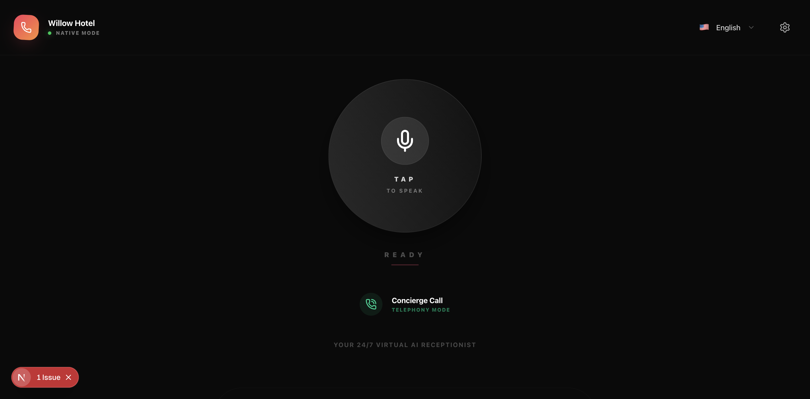
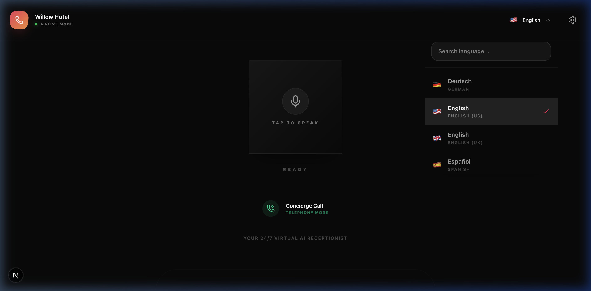

# 🎙️ Willow Hotel AI — Premium Voice Receptionist

> **A world-class, AI-driven hospitality interface built with Next.js 16 and Google Gemini 2.5 Flash Lite.**



This is a **flagship-level AI voice assistant** designed for luxury hospitality. It features a stunning glassmorphic interface, a focal "Morphing Orb" interaction point, and a shared intelligence engine that powers both the Web and Phone (Telephony) interfaces.

---

## ✨ Flagship UI/UX

| Feature | Description |
|---------|-------------|
| 🔮 **Morphing Interaction Orb** | A fluid, animated central centerpiece that morphs and ripples organically based on AI states (Listening, Processing, Speaking). |
| 💎 **Glassmorphism System** | A sophisticated design system in Tailwind v4 featuring backdrop blurs, ambient glows, and a deep dark-mode palette. |
| 🌍 **Universal Language Desk** | Support for 34 languages with a premium, flag-integrated selection interface. |
| 📞 **Telephony Bridge** | Dedicated "Concierge Call" mode for transitioning digital guests to live voice lines seamlessly. |

---

## 🧠 Core Intelligence

- **Engine:** Google Gemini 2.5 Flash Lite (`/api/chat`).
- **Dynamic Persona:** The assistant relies on a shared `responseEngine.ts`, ensuring it never gives repetitive "saved" answers.
- **Failover STT:** Multi-layered transcription that switches from browser-native to server-side Gemini STT if connectivity is unstable.

---

## 🚀 Getting Started

### 1. Environment Setup
Add your API key to `.env.local`:
```bash
GOOGLE_GENERATIVE_AI_API_KEY=your_gemini_key_here
```

### 2. Branding (Single Source of Truth)
All hotel details, policies, and receptionist personality are managed in:
`src/lib/hotelConfig.ts`

```typescript
export const DEFAULT_HOTEL_CONFIG: HotelConfig = {
  branding: {
    hotelName: "Willow Hotel",
    accentColor: "#f43f5e",
    tagline: "Premium AI Concierge",
  },
  ...
};
```

---

## 📸 Interface Preview

<p align="center">
  
  
</p>

---

## 📁 Project Architecture

| Route | Purpose |
|-------|---------|
| `src/lib/responseEngine.ts` | The shared brain for Web, Phone, and STT. |
| `src/app/api/chat` | Main interaction endpoint. |
| `src/app/api/telephony` | Real-time webhook for phone calls. |
| `src/app/globals.css` | Premium design system & animations. |

---

## 📜 License & Credits

Built with ❤️ by **Prabin Sharma** ([@prabin923](https://github.com/prabin923)).  
Powered by Next.js 16, Tailwind CSS v4, and Google Gemini.
