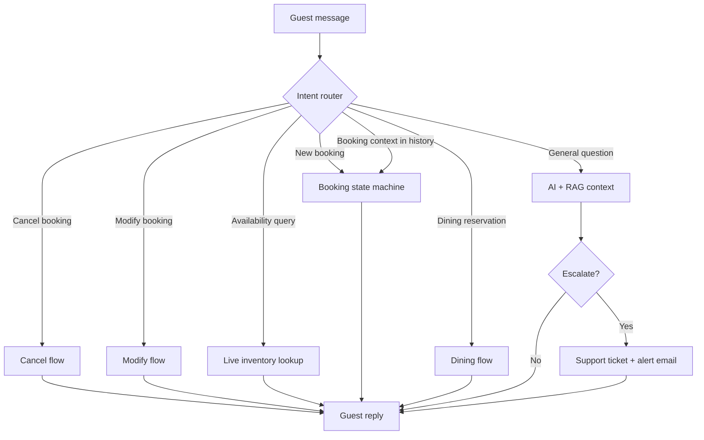
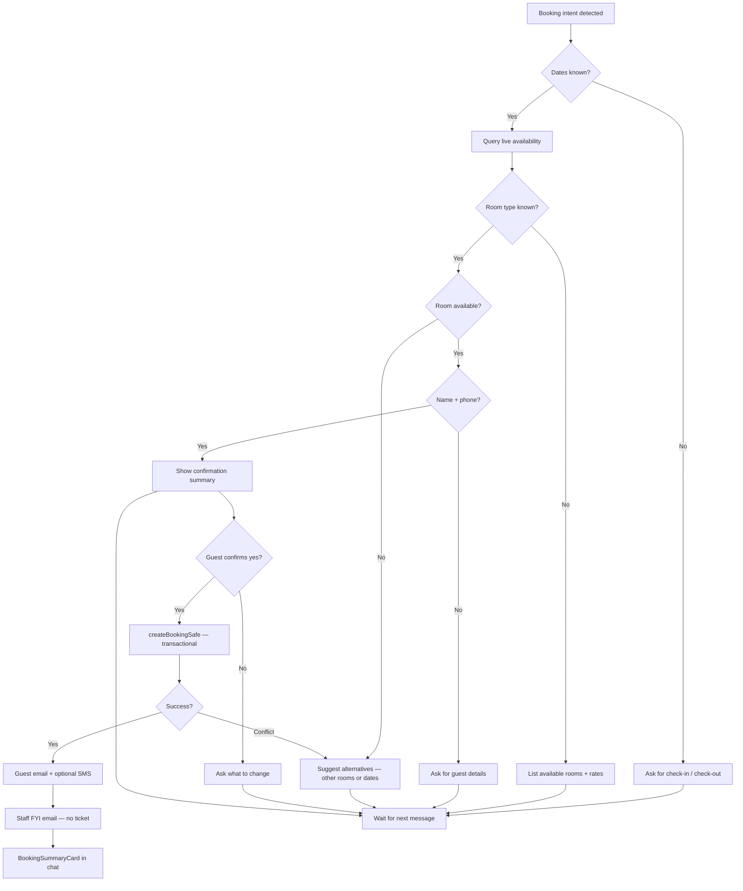
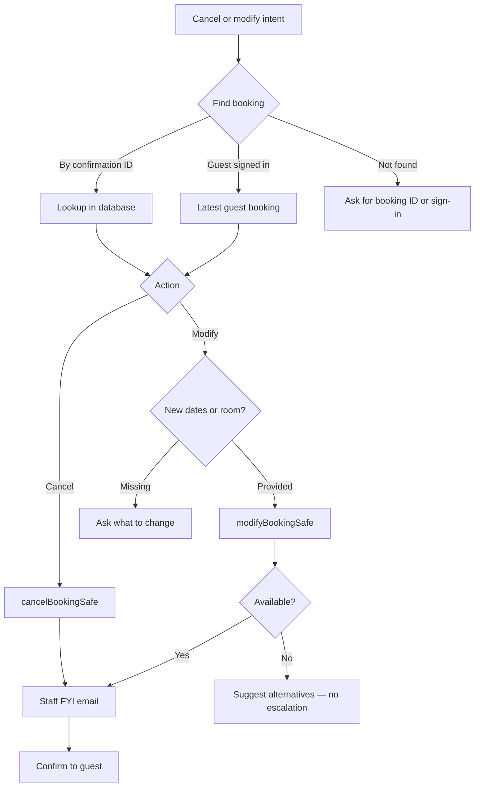
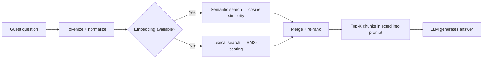
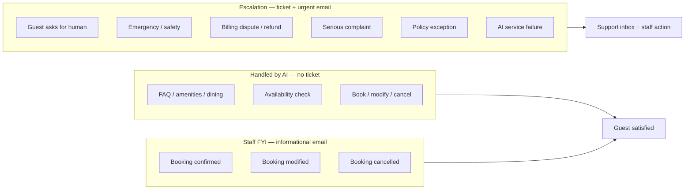
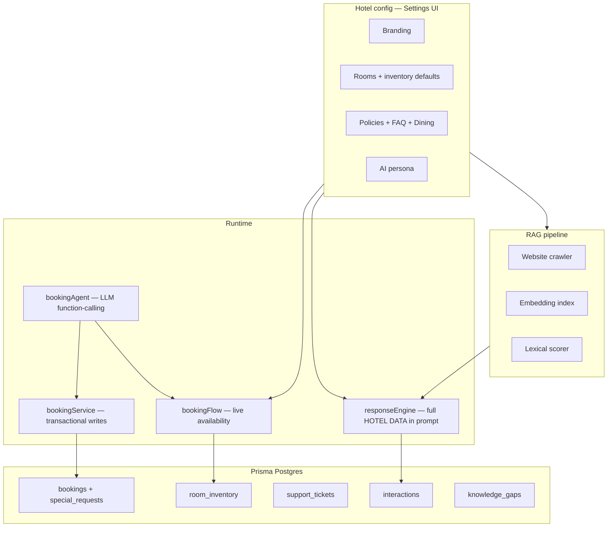

# StayNep AI Voice Receptionist

> **An intelligent, multilingual voice assistant for hotel guest services — powered by Next.js 16, Google Gemini, and autonomous booking.**

A production-ready AI voice receptionist that provides 24/7 multilingual guest support for hotels. Guests speak in any of 34 supported languages and receive instant, spoken responses with hotel-specific knowledge. The assistant handles **live availability checks**, **end-to-end bookings**, **modifications**, and **cancellations** on its own — staff are notified only when a booking is completed (FYI) or when a situation truly needs a human.

Built as the foundation for **StayNep** — a comprehensive hotel management platform for Nepal's hospitality industry.

---

## Features

| Feature | Description |
|---------|-------------|
| **Voice-to-Voice Chat** | Tap to speak; voice mode streams replies and speaks sentence-by-sentence for faster turn-taking |
| **Autonomous Booking** | Check availability, book, modify, and cancel — without front-desk handoff |
| **Booking Agent (Function Calling)** | LLM-driven receptionist uses tool calls for real inventory lookups and transactional writes — never hallucinates availability |
| **Booking Confirmation** | Summarizes the stay and waits for guest "yes" before creating the reservation |
| **Special Requests** | Late checkout, dietary needs, accessibility notes — stored on the booking and sent to staff |
| **Live Inventory** | Real-time room availability from Prisma Postgres |
| **Smart Alternatives** | Suggests other room types or nearby dates when sold out |
| **Tiered Staff Alerts** | FYI emails on completed bookings; escalation tickets only when critical |
| **SMS Confirmations** | Optional TingTing SMS after booking (alongside email) |
| **My Stay Panel** | Signed-in guests see upcoming bookings, ask about them, or cancel from the assistant sidebar |
| **Quick Actions** | Sticky shortcuts in chat — book, directions, dining, my booking |
| **Service Health** | Live AI / DB / STT / SMS / Email readiness indicators in the assistant UI |
| **FAQ Gap Reporter** | Unanswered guest questions logged on escalation; review and add to FAQ in Settings |
| **RAG Knowledge Base** | Semantic (embedding) + lexical (BM25-style) retrieval over hotel config and crawled website content |
| **Reply Localization** | Deterministic booking/dining confirmations are auto-translated into the guest's language via AI |
| **Rich Hotel Context** | Dining, FAQ, full policies, amenities, and room details in AI prompt |
| **Conversation Memory** | Multi-turn booking — collect dates, room, name, and phone across messages |
| **34 Languages** | Full multilingual support via Gemini — Arabic to Vietnamese |
| **Multiple TTS Engines** | Edge TTS, MiniMax TTS, OpenAI TTS, and browser fallback |
| **Multiple STT Engines** | OpenAI Whisper, Gemini multimodal, self-hosted Whisper (Docker), and browser Web Speech API |
| **Guest Accounts** | Sign-in pre-fills name, phone, and links bookings |
| **Embeddable Widget** | Drop the assistant into any hotel website via `<iframe>` with full cross-site cookie support |
| **Multi-Tenant** | Slug-based hotel isolation with per-tenant config caching and `AsyncLocalStorage` context |
| **CSRF Protection** | Double-submit cookie + origin validation on all state-changing endpoints |
| **Dining Reservations** | Table booking flow with time-slot management |
| **Admin Dashboard** | Settings, analytics, calendar inventory, support inbox |
| **Telephony** | Telnyx / generic webhook voice integration |
| **WhatsApp Integration** | Inbound guest messages via WhatsApp webhook |
| **Payment Integration** | Stripe-based payment flow for bookings |

---

## Tech Stack

| Category | Technology |
|----------|-----------|
| Frontend | Next.js 16, React 19, TypeScript |
| Styling | Tailwind CSS v4, Glassmorphism, GSAP animations |
| AI Engine | Google Gemini / OpenAI (configurable, with function calling) |
| STT | OpenAI Whisper · Gemini multimodal · Self-hosted Whisper (Docker) · Browser Web Speech |
| TTS | Edge TTS · MiniMax TTS · OpenAI TTS · Browser Speech Synthesis |
| Database | Prisma ORM + Prisma Postgres |
| RAG | Gemini / OpenAI embeddings + lexical BM25-style scoring + website crawler |
| Email | Nodemailer (guest confirmations + staff FYI + escalations) |
| SMS | TingTing (optional booking confirmations) |
| Payment | Stripe |
| Auth | JWT (jose) + bcryptjs + CSRF double-submit |

---

## Getting Started

### 1. Clone and install

```bash
git clone https://github.com/prabin923/Voice-assistant.git
cd Voice-assistant
npm install
```

### 2. Environment setup

Create a `.env.local` for app secrets (see `.env.example`). Link Prisma Postgres for the database:

```bash
npx prisma postgres link --database <your-database-id>
npx prisma migrate dev
npx prisma db seed   # optional sample data
```

```bash
# Required
GOOGLE_GENERATIVE_AI_API_KEY=your_key_from_aistudio.google.com
JWT_SECRET=your_random_secret_here
NEXT_PUBLIC_APP_URL=https://your-production-domain.com
WEBHOOK_SECRET=your_webhook_shared_secret

# Optional: OpenAI (Whisper STT, TTS, or as alternate AI provider)
OPENAI_API_KEY=sk-...
OPENAI_STT_MODEL=whisper-1          # or gpt-4o-mini-transcribe / gpt-4o-transcribe

# Optional: Azure Speech (MAI-Voice + MAI-Transcribe)
AZURE_SPEECH_KEY=...
AZURE_SPEECH_ENDPOINT=https://your-resource.cognitiveservices.azure.com

# Optional: SMTP for guest confirmations, staff FYI, and escalation alerts
SMTP_HOST=smtp.gmail.com
SMTP_PORT=587
SMTP_USER=your-email@gmail.com
SMTP_PASS=your-app-password
SMTP_FROM=ai-receptionist@yourhotel.com

# Optional: TingTing SMS for booking confirmations
TINGTING_API_KEY=your_tingting_api_key

# Optional: Stripe payment
STRIPE_SECRET_KEY=sk_...
STRIPE_WEBHOOK_SECRET=whsec_...

# Optional: Self-hosted Whisper (Docker)
WHISPER_ENDPOINT=http://localhost:9000
```

### 3. Run the dev server

```bash
npm run dev
```

Open [http://localhost:3000/assistant](http://localhost:3000/assistant).

### 4. Self-hosted Whisper (optional)

For free, offline STT using a local Whisper container:

```bash
npm run whisper:up    # docker compose -f docker-compose.whisper.yml up -d
npm run whisper:down  # stop the container
```

---

## Embeddable Widget

Hotels can embed the assistant on their own website with a single `<iframe>`:

```html
<iframe
  src="https://your-staynep-domain.com/embed/your-hotel-slug"
  width="400"
  height="600"
  style="border: none; border-radius: 16px;"
  allow="microphone"
></iframe>
```

Cross-site cookies (`SameSite=None; Secure`) are automatically configured so guest sessions, CSRF tokens, and auth persist inside the iframe. Works on `localhost` for development (Chrome/Firefox — Safari blocks all third-party cookies).

---

## Architecture Flowcharts

### 1. Guest message routing

Every message to `/api/chat` is routed by intent before the general AI is invoked.



### 2. Autonomous booking flow

Bookings complete without staff involvement during the conversation. Staff receive an **informational FYI email** after success.



### 3. Cancel and modify flows



### 4. RAG retrieval pipeline



### 5. Staff notification tiers



### 6. Voice assistant session


### 7. Data and configuration



---

## Project Structure

```
src/lib/
├── bookingFlow.ts            # Intent router: book / modify / cancel / availability / special requests
├── bookingAgent.ts           # LLM receptionist with function-calling tools (no hallucinated availability)
├── bookingService.ts         # Transactional create, modify, cancel
├── bookingNotify.ts          # Unified guest email + SMS + staff FYI after booking events
├── dateParsing.ts            # Natural language + ISO date extraction
├── availabilityQuery.ts      # Live inventory + alternative suggestions
├── diningFlow.ts             # Dining reservation conversation flow
├── diningReservationService.ts # Table booking service
├── responseEngine.ts         # AI prompt + streaming for voice mode
├── replyLocalize.ts          # Auto-translate deterministic replies into the guest's language
├── csrf.ts                   # CSRF double-submit cookie + origin validation
├── cookieOptions.ts          # Cross-site cookie options for embedded iframe
├── tenantContext.ts          # Multi-tenant AsyncLocalStorage context + config cache
├── guestAuth.ts              # Guest JWT authentication
├── auth.ts                   # Admin JWT authentication
├── staffNotifications.ts     # FYI emails after booking events
├── escalation.ts             # Support tickets + knowledge gap creation
├── knowledgeGaps.ts          # FAQ gap logging from escalations
├── email.ts                  # Guest confirmations + staff FYI + escalations
├── sms.ts                    # TingTing SMS for booking confirmations
├── stripePayment.ts          # Stripe payment integration
├── whatsapp.ts               # WhatsApp webhook integration
├── telnyxWebhook.ts          # Telephony webhook handler
│
├── rag/
│   ├── augmentMessage.ts     # Build hotel-data context block for prompts
│   ├── knowledgeIndex.ts     # Embedding-based semantic search index
│   ├── embeddings.ts         # Gemini / OpenAI embedding provider
│   ├── lexical.ts            # BM25-style lexical scorer (multilingual)
│   ├── similarity.ts         # Cosine similarity helper
│   ├── chunkHotelConfig.ts   # Split hotel config into searchable chunks
│   ├── conversationExamples.ts # Few-shot examples for the AI prompt
│   └── websiteCrawler.ts     # Crawl hotel website for RAG ingestion
│
├── voiceStack.ts             # Voice stack selector (cloud / free / browser)
├── edgeTts.ts                # Edge TTS engine
├── minimaxTts.ts             # MiniMax TTS engine
├── openaiWhisper.ts          # OpenAI Whisper STT
├── selfHostedStt.ts          # Self-hosted Whisper (Docker) STT
├── nemotronSpeech.ts         # NVIDIA Nemotron speech
└── languages.ts              # 34-language registry

src/components/
├── BookingSummaryCard.tsx     # Confirmation card with copy ID + calendar link
├── BookingsCenter.tsx        # Full bookings management panel
├── CalendarInventoryCenter.tsx # Room inventory calendar view
├── CallOverlay.tsx           # Voice call UI overlay
├── GuestAuthPanel.tsx        # Guest sign-in / register panel
├── MyStayPanel.tsx           # Guest upcoming bookings sidebar
├── QuickActionsBar.tsx       # Sticky chat shortcuts
├── ServiceHealthBar.tsx      # AI / DB / STT / SMS / Email status
├── StaffNotificationCenter.tsx # Staff notification management
├── VoicePipelineDemo.tsx     # Voice pipeline demonstration
└── SpectrogramWaveform.tsx   # Audio waveform visualizer

src/app/
├── assistant/                # Guest-facing AI voice assistant
├── embed/[slug]/             # Embeddable widget for hotel websites
├── settings/                 # Hotel admin settings dashboard
├── admin/                    # Analytics, support inbox
├── onboarding/               # Hotel onboarding wizard
├── payment/                  # Stripe payment flow
├── demo/                     # Demo mode
└── superadmin/               # Platform-wide super admin

src/app/api/
├── chat/route.ts             # Text chat + booking (JSON)
├── chat/stream/route.ts      # Voice chat with SSE streaming
├── bookings/route.ts         # Booking CRUD
├── guest/auth/               # Guest login / register / logout
├── guest/bookings/           # Guest booking management
├── availability/             # Room availability queries
├── rag/sync/route.ts         # RAG knowledge base sync
├── stt/route.ts              # Speech-to-text endpoint
├── tts/route.ts              # Text-to-speech endpoint
├── health/route.ts           # Service readiness check
├── knowledge-gaps/           # FAQ gap management
├── support/                  # Support ticket management
├── payment/                  # Stripe webhooks
├── telephony/                # Telnyx voice webhooks
├── whatsapp/                 # WhatsApp message webhooks
└── feedback/                 # Guest feedback collection
```

---

## API Reference

| Endpoint | Method | Auth | Purpose |
|----------|--------|------|---------|
| `/api/chat` | POST | Guest rate limit | Text conversation + autonomous booking |
| `/api/chat/stream` | POST | Guest rate limit | Voice conversation with SSE streaming |
| `/api/bookings` | POST | Guest / public | Direct booking creation |
| `/api/bookings/[id]` | PATCH | Guest session | Modify booking |
| `/api/guest/auth/login` | POST | Public | Guest login |
| `/api/guest/auth/register` | POST | Public | Guest registration |
| `/api/guest/auth/logout` | POST | Guest session | Guest logout |
| `/api/guest/bookings` | GET | Guest session | List guest's bookings (My Stay panel) |
| `/api/guest/bookings/[id]` | GET/PATCH | Guest session | View or modify a specific booking |
| `/api/availability` | GET | Admin | Calendar inventory (Settings) |
| `/api/stt` | POST | Guest rate limit | Speech-to-text transcription |
| `/api/tts` | POST | Guest rate limit | Text-to-speech synthesis |
| `/api/rag/sync` | POST | Admin | Sync RAG knowledge index |
| `/api/knowledge-gaps` | GET/PATCH | Admin | Open FAQ gaps from escalations |
| `/api/health` | GET | Public | Service readiness (AI, DB, STT, SMS, email) |
| `/api/support` | GET/POST | Admin | Support ticket management |
| `/api/payment` | POST | Guest | Stripe checkout session |
| `/api/telephony` | POST | Webhook | Telnyx voice call events |
| `/api/whatsapp` | POST | Webhook | WhatsApp inbound messages |
| `/api/feedback` | POST | Guest | Submit guest feedback |

---

## Email Notifications

| Event | Recipient | Type |
|-------|-----------|------|
| Booking confirmed | Guest (if email provided) | Confirmation email |
| Booking confirmed | Guest (if phone provided) | SMS via TingTing (optional) |
| Booking confirmed / modified / cancelled | Staff (`contact.email`) | FYI — no ticket (includes special requests) |
| Special request added | Staff | FYI — booking modified |
| Escalation (complaint, emergency, human request) | Staff | Urgent ticket + email |
| AI could not answer | Settings → FAQ gaps | Logged for admin review |

Without SMTP, emails are logged to the server console. Without `TINGTING_API_KEY`, SMS is logged to the console.

---

## Security

- **CSRF Protection** — Double-submit cookie pattern with origin validation on all POST/PATCH/DELETE requests. The `csrf-token` cookie is set on first load and matched against the `x-csrf-token` header.
- **JWT Auth** — Separate admin and guest JWTs via `jose`, with bcrypt password hashing.
- **Cross-Site Cookies** — `SameSite=None; Secure` cookies for the embeddable iframe, ensuring sessions and CSRF tokens work in third-party contexts.
- **Rate Limiting** — Per-IP and distributed rate limiting on guest-facing endpoints.
- **Safe Redirects** — URL validation to prevent open redirect attacks.
- **Login Lockout** — Brute-force protection with exponential backoff.

---

## Admin Features

### Settings (`/settings`)
Branding, contact, policies, rooms, dining, amenities, custom FAQ (with **FAQ gap reporter** from escalations), AI persona, calendar inventory, bookings list, and staff notification center.

### Support Inbox (`/admin/support`)
Priority-sorted **escalation** tickets only — not routine bookings.

### Analytics (`/admin/analytics`)
Interaction volume, escalation rate, language distribution, guest satisfaction.

---

## Auth Flow

1. Hotel admin registers at `/admin/register`
2. Login at `/admin/login`
3. Authenticated users access `/settings`, analytics, and support
4. Guest sign-in on the assistant pre-fills booking details and links bookings

---

## Scripts

| Command | Description |
|---------|-------------|
| `npm run dev` | Start Next.js dev server |
| `npm run build` | Generate Prisma client + production build |
| `npm run test` | Run Vitest test suite |
| `npm run db:migrate` | Run Prisma migrations |
| `npm run db:push` | Push schema to database |
| `npm run db:seed` | Seed sample data |
| `npm run db:studio` | Open Prisma Studio |
| `npm run whisper:up` | Start self-hosted Whisper container |
| `npm run whisper:down` | Stop self-hosted Whisper container |
| `npm run demo:verify` | Verify college demo voice setup |
| `npm run demo:setup` | Setup college demo environment |

---

## About StayNep

This voice assistant is a core module of **StayNep** — a hotel management system for Nepal's hospitality industry.

---

## License & Credits

Built by **Prabin Sharma** ([@prabin923](https://github.com/prabin923)).
Powered by Next.js 16, Tailwind CSS v4, Google Gemini, and OpenAI.
