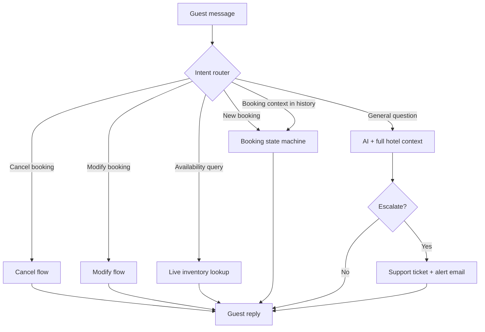
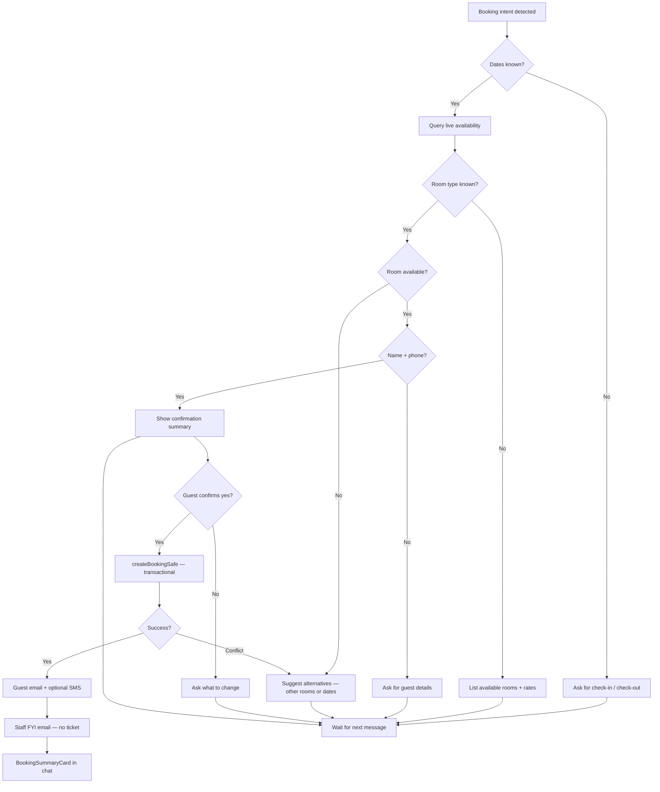
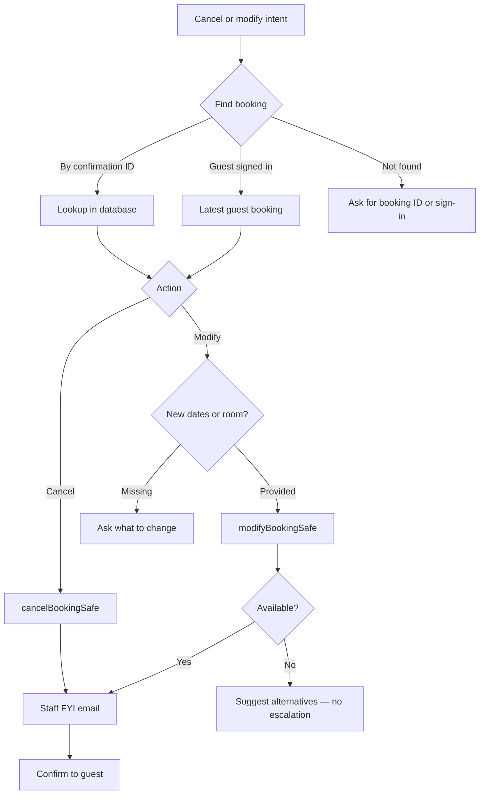
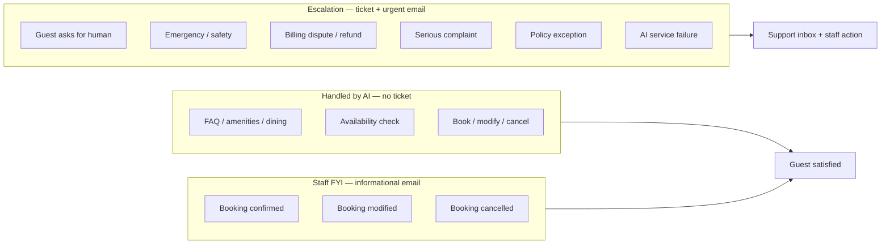
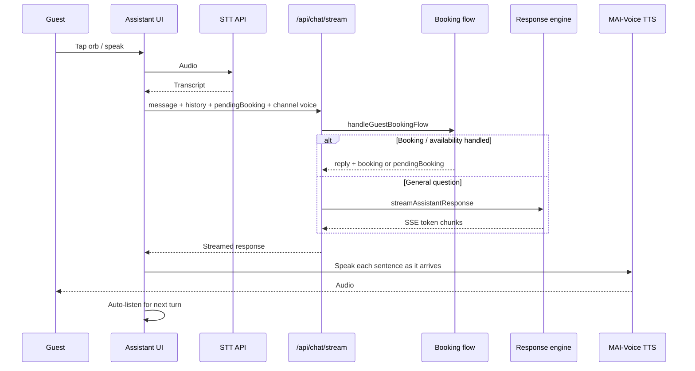
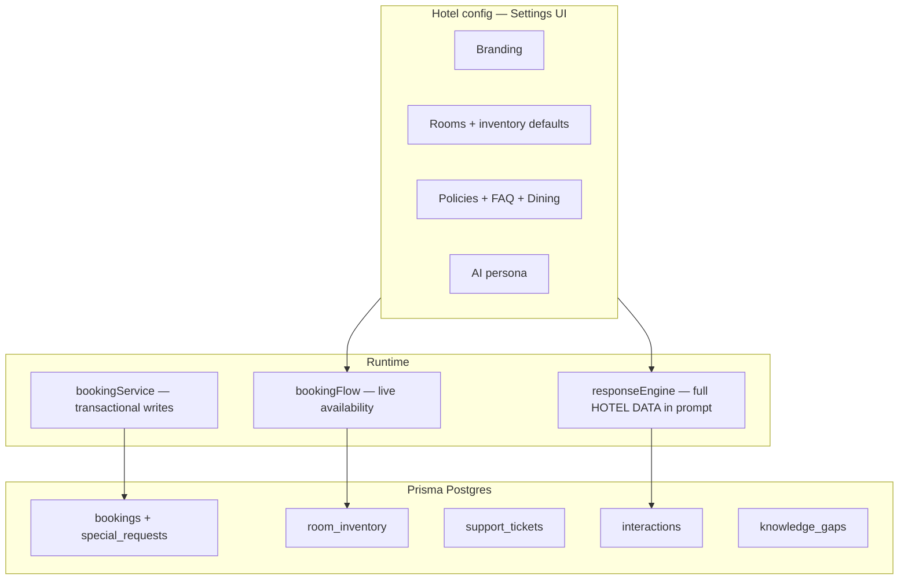

# StayNep AI Voice Receptionist

> **An intelligent, multilingual voice assistant for hotel guest services — powered by Next.js 16, Google Gemini, and autonomous booking.**

A production-ready AI voice receptionist that provides 24/7 multilingual guest support for hotels. Guests speak in any configured language and receive instant, spoken responses with hotel-specific knowledge. The assistant handles **live availability checks**, **end-to-end bookings**, **modifications**, and **cancellations** on its own — staff are notified only when a booking is completed (FYI) or when a situation truly needs a human.

Built as the foundation for **StayNep** — a comprehensive hotel management platform for Nepal's hospitality industry.

---

## Poster Summary

**StayNep: Your Hotel, Now With a Voice**

StayNep is an AI-powered voice concierge platform for modern hotels. Guests can speak naturally in 40+ languages to compare rooms and facilities, ask about pricing and policies, check availability, make bookings, reserve dining or spa services, and request help during their stay.

Hotels can embed the assistant on their website, share it through QR codes, connect it to hotel management systems, and use it to automate front-desk support, guest operations, staff handoff, and analytics.

**Poster copy:** AI voice concierge for hotels — answer guest questions, recommend rooms and facilities, take bookings, manage service requests, and support guests 24/7 in 40+ languages.

---

## Features

| Feature | Description |
|---------|-------------|
| **Voice-to-Voice Chat** | Tap to speak; voice mode streams replies and speaks sentence-by-sentence for faster turn-taking |
| **Autonomous Booking** | Check availability, book, modify, and cancel — without front-desk handoff |
| **Booking Confirmation** | Summarizes the stay and waits for guest "yes" before creating the reservation |
| **Special Requests** | Late checkout, dietary needs, accessibility notes — stored on the booking and sent to staff |
| **Live Inventory** | Real-time room availability from Prisma Postgres |
| **Smart Alternatives** | Suggests other room types or nearby dates when sold out |
| **Tiered Staff Alerts** | FYI emails on completed bookings; escalation tickets only when critical |
| **SMS Confirmations** | Optional TingTing SMS after booking (alongside email) |
| **My Stay Panel** | Signed-in guests see upcoming bookings, ask about them, or cancel from the assistant sidebar |
| **Operations Queue** | Mobile-friendly staff view for housekeeping, maintenance, and room-service tasks |
| **Task Dispatch** | Staff can create tasks manually; guest-created service requests notify staff automatically |
| **HMS Integration** | Import hotel profile, rooms, amenities, dining, spa, policies, and decision FAQs from any JSON-based hotel system |
| **Quick Actions** | Sticky shortcuts in chat — book, directions, dining, my booking |
| **Service Health** | Live AI / DB / STT / SMS / Email readiness indicators in the assistant UI |
| **FAQ Gap Reporter** | Unanswered guest questions logged on escalation; review and add to FAQ in Settings |
| **Rich Hotel Context** | Dining, FAQ, full policies, amenities, and room details in AI prompt |
| **Conversation Memory** | Multi-turn booking — collect dates, room, name, and phone across messages |
| **40+ Languages** | Language-neutral RAG and response support across every configured locale |
| **MAI-Voice TTS** | Azure MAI-Voice with browser fallback |
| **Guest Accounts** | Sign-in pre-fills name, phone, and links bookings |
| **Admin Dashboard** | Settings, analytics, calendar inventory, support inbox |
| **Telephony** | Telnyx / generic webhook voice integration |

---

## Tech Stack

| Category | Technology |
|----------|-----------|
| Frontend | Next.js 16, React 19, TypeScript |
| Styling | Tailwind CSS v4, Glassmorphism |
| AI Engine | Google Gemini / OpenAI (configurable) |
| STT | MAI-Transcribe (Azure) + Gemini + browser |
| TTS | MAI-Voice (Azure) + Web Speech Synthesis |
| Database | Prisma ORM + Prisma Postgres |
| Email | Nodemailer (guest confirmations + staff FYI + escalations) |
| SMS | TingTing (optional booking confirmations) |

---

## Getting Started

### 1. Clone and install

```bash
git clone https://github.com/prabin923/Voice-assistant.git
cd Voice-assistant
npm install
```

### 2. Environment setup

Create a `.env.local` for app secrets (see `.env.example`). Link Prisma Postgres for the database:

```bash
npx prisma postgres link --database <your-database-id>
npx prisma migrate dev
npx prisma db seed   # optional sample data
```

```bash
GOOGLE_GENERATIVE_AI_API_KEY=your_key_from_aistudio.google.com
JWT_SECRET=your_random_secret_here
NEXT_PUBLIC_APP_URL=https://your-production-domain.com
WEBHOOK_SECRET=your_webhook_shared_secret

# Optional: Azure Speech (MAI-Voice + MAI-Transcribe)
AZURE_SPEECH_KEY=...
AZURE_SPEECH_ENDPOINT=https://your-resource.cognitiveservices.azure.com

# Optional: SMTP for guest confirmations, staff FYI, and escalation alerts
SMTP_HOST=smtp.gmail.com
SMTP_PORT=587
SMTP_USER=your-email@gmail.com
SMTP_PASS=your-app-password
SMTP_FROM=ai-receptionist@yourhotel.com

# Optional: TingTing SMS for booking confirmations
TINGTING_API_KEY=your_tingting_api_key
```

### 3. Run the dev server

```bash
npm run dev
```

Open [http://localhost:3000/assistant](http://localhost:3000/assistant).

---

## Architecture Flowcharts

### 1. Guest message routing

Every message to `/api/chat` is routed by intent before the general AI is invoked.



### 2. Autonomous booking flow

Bookings complete without staff involvement during the conversation. Staff receive an **informational FYI email** after success.



### 3. Cancel and modify flows



### 4. Staff notification tiers



### 5. Voice assistant session



### 6. Data and configuration



---

## Project Structure

```
src/lib/
├── bookingFlow.ts          # Intent router: book / modify / cancel / availability / special requests
├── bookingService.ts       # Transactional create, modify, cancel
├── bookingNotify.ts        # Unified guest email + SMS + staff FYI after booking events
├── dateParsing.ts          # Natural language + ISO date extraction
├── availabilityQuery.ts    # Live inventory + alternative suggestions
├── staffNotifications.ts   # FYI emails after booking events
├── knowledgeGaps.ts        # FAQ gap logging from escalations
├── sms.ts                  # TingTing SMS for booking confirmations
├── responseEngine.ts       # AI prompt + streaming for voice mode
├── escalation.ts           # Support tickets + knowledge gap creation
└── email.ts                # Guest confirmations + staff FYI + escalations

src/components/
├── MyStayPanel.tsx         # Guest upcoming bookings sidebar
├── QuickActionsBar.tsx     # Sticky chat shortcuts
├── ServiceHealthBar.tsx    # AI / DB / STT / SMS / Email status
└── BookingSummaryCard.tsx  # Confirmation card with copy ID + calendar link

src/app/api/chat/route.ts         # Text chat + booking (JSON)
src/app/api/chat/stream/route.ts  # Voice chat with SSE streaming
src/app/api/knowledge-gaps/route.ts
src/app/api/health/route.ts
```

---

## Booking API

| Endpoint | Auth | Purpose |
|----------|------|---------|
| `POST /api/chat` | Guest rate limit | Text conversation + autonomous booking |
| `POST /api/chat/stream` | Guest rate limit | Voice conversation with SSE streaming |
| `POST /api/bookings` | Guest / public | Direct booking creation |
| `PATCH /api/bookings/[id]` | Guest session | Modify booking |
| `GET /api/guest/bookings` | Guest session | List guest's bookings (My Stay panel) |
| `GET /api/availability` | Admin | Calendar inventory (Settings) |
| `GET /api/knowledge-gaps` | Admin | Open FAQ gaps from escalations |
| `PATCH /api/knowledge-gaps` | Admin | Mark gap as added to FAQ or dismissed |
| `GET /api/health` | Public | Service readiness (AI, DB, STT, SMS, email) |

---

## Email notifications

| Event | Recipient | Type |
|-------|-----------|------|
| Booking confirmed | Guest (if email provided) | Confirmation email |
| Booking confirmed | Guest (if phone provided) | SMS via TingTing (optional) |
| Booking confirmed / modified / cancelled | Staff (`contact.email`) | FYI — no ticket (includes special requests) |
| Special request added | Staff | FYI — booking modified |
| Escalation (complaint, emergency, human request) | Staff | Urgent ticket + email |
| AI could not answer | Settings → FAQ gaps | Logged for admin review |

Without SMTP, emails are logged to the server console. Without `TINGTING_API_KEY`, SMS is logged to the console.

---

## Admin Features

### Settings (`/settings`)
Branding, contact, policies, rooms, dining, amenities, custom FAQ (with **FAQ gap reporter** from escalations), AI persona, calendar inventory, bookings list, and staff notification center.

### Support Inbox (`/admin/support`)
Priority-sorted **escalation** tickets only — not routine bookings.

### Operations Queue (`/admin/operations`)
Mobile-first queue for housekeeping, maintenance, and room-service requests. Staff can dispatch manual tasks and move work from open to in progress to completed.

### HMS Integration (`/settings` → HMS Integration)
Sync any hotel management system that exposes JSON. Imported room, facility, dining, spa, policy, and FAQ data updates assistant settings and helps guests choose hotels, rooms, and facilities.

### Analytics (`/admin/analytics`)
Interaction volume, escalation rate, language distribution, guest satisfaction.

---

## Auth Flow

1. Hotel admin registers at `/admin/register`
2. Login at `/admin/login`
3. Authenticated users access `/settings`, operations, analytics, and support
4. Guest sign-in on the assistant pre-fills booking details

---

## About StayNep

This voice assistant is a core module of **StayNep** — a hotel management system for Nepal's hospitality industry.

---

## License & Credits

Built by **Prabin Sharma** ([@prabin923](https://github.com/prabin923)).
Powered by Next.js 16, Tailwind CSS v4, Google Gemini, and Azure Speech.
