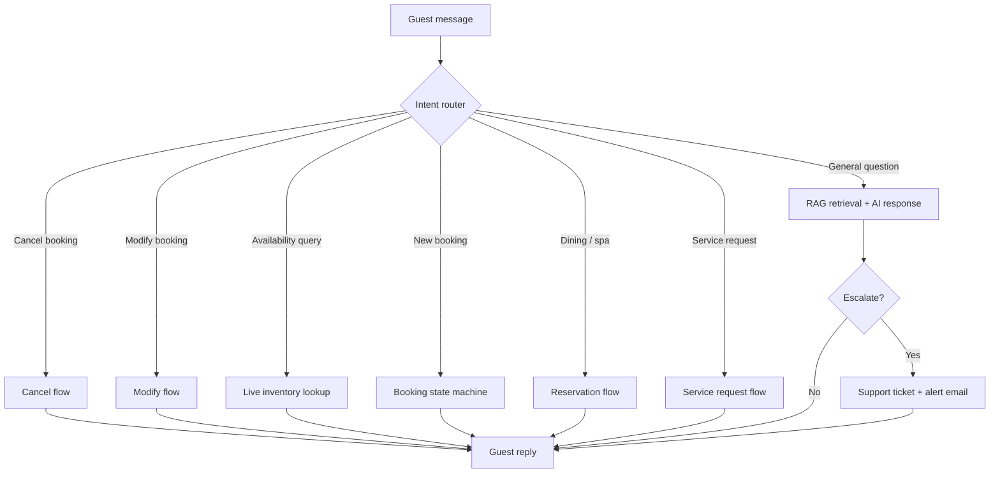
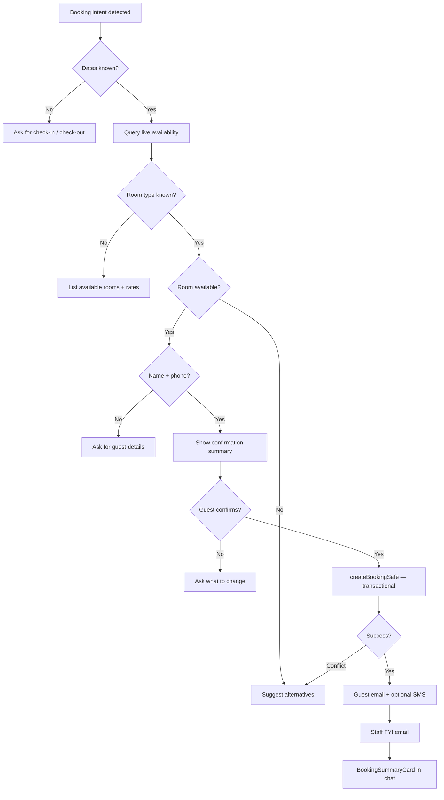
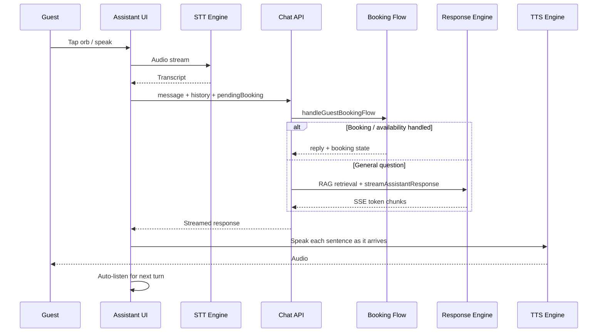
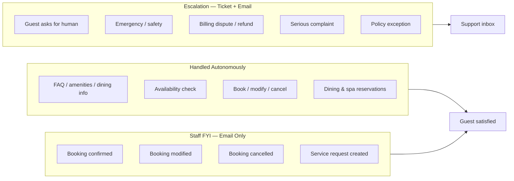

# StayNep — AI Voice Concierge for Hotels

> **Multi-tenant, multilingual voice assistant platform that handles guest conversations, autonomous bookings, dining & spa reservations, service requests, and staff operations — powered by Next.js 16, Google Gemini, and RAG.**

StayNep is a production-grade AI voice concierge SaaS for the hospitality industry. Each hotel gets its own branded assistant with a unique knowledge base, conversation memory, and booking engine. Guests speak naturally in 40+ languages and get instant, spoken responses grounded in the hotel's real data — rooms, policies, dining, amenities, and FAQs.

The assistant handles **live availability checks**, **end-to-end room bookings**, **dining and spa reservations**, **modifications**, **cancellations**, and **service requests** autonomously. Staff are notified only when a booking completes (FYI) or when a situation genuinely requires human intervention.

Built as the foundation for **StayNep** — a comprehensive hotel management platform for Nepal's hospitality industry.

---

## Features

### Guest-Facing

| Feature | Description |
|---------|-------------|
| **Voice-to-Voice Chat** | Tap the orb to speak; voice mode streams replies and speaks sentence-by-sentence for fast turn-taking |
| **Autonomous Booking** | Check availability, book, modify, and cancel rooms — no front-desk handoff |
| **Dining & Spa Reservations** | Book restaurant tables and spa treatments through natural conversation |
| **Booking Confirmation** | Shows a summary card and waits for guest "yes" before committing |
| **Special Requests** | Late checkout, dietary needs, accessibility notes — stored on the booking and forwarded to staff |
| **Live Inventory** | Real-time room availability from Prisma Postgres with date-level overrides |
| **Smart Alternatives** | Suggests other room types or nearby dates when sold out |
| **My Stay Panel** | Signed-in guests see upcoming bookings, manage them, or cancel from the assistant sidebar |
| **Quick Actions** | Sticky chat shortcuts — book a room, get directions, view dining, check my booking |
| **Guest Reviews** | Guests can leave ratings and reviews; staff can moderate and respond |
| **Guest Loyalty** | Visit count, message count, and booking history tracked per guest account |
| **40+ Languages** | Language-neutral RAG retrieval and response localization across every configured locale |
| **WhatsApp Integration** | Twilio-powered WhatsApp channel with persistent conversation sessions |
| **Embeddable Widget** | Drop-in `<script>` tag to embed the assistant on any hotel website |
| **Stripe Payments** | Optional deposit collection during booking via Stripe Checkout |
| **Service Health** | Live AI / DB / STT / SMS / Email readiness indicators in the assistant UI |

### Hotel Admin

| Feature | Description |
|---------|-------------|
| **Settings Dashboard** | Branding, contact, policies, rooms, dining, spa, amenities, AI persona, custom FAQ |
| **Calendar Inventory** | Visual calendar for room availability with date-level overrides |
| **Bookings Center** | View, filter, and manage all reservations |
| **Operations Queue** | Mobile-first queue for housekeeping, maintenance, and room-service — open → in progress → done |
| **Support Inbox** | Priority-sorted escalation tickets — not routine bookings |
| **FAQ Gap Reporter** | Unanswered guest questions logged on escalation; review and add to FAQ from Settings |
| **Staff Notifications** | Real-time notification center for bookings, service requests, and escalations |
| **Analytics** | Interaction volume, escalation rate, language distribution, guest satisfaction |
| **HMS Integration** | Import rooms, amenities, dining, spa, policies, and FAQ from any JSON-based hotel management system |

### Platform (Super Admin)

| Feature | Description |
|---------|-------------|
| **Multi-Tenant Architecture** | Row-level tenant isolation; each hotel gets its own config, data, and branded assistant |
| **Super Admin Dashboard** | Platform-wide hotel management, onboarding, and monitoring |
| **RAG Knowledge Engine** | Automatic chunking, embedding, and semantic retrieval of hotel knowledge for grounded AI responses |
| **Telephony** | Telnyx programmable voice + generic webhook integration for phone-based AI conversations |

---

## Tech Stack

| Category | Technology |
|----------|-----------|
| Framework | Next.js 16 (App Router), React 19, TypeScript |
| Styling | Tailwind CSS v4, glassmorphism design system |
| AI / LLM | Google Gemini (primary), OpenAI (fallback) |
| RAG | Gemini embeddings, cosine similarity, chunked hotel knowledge index |
| STT | Nemotron ASR, self-hosted Whisper, Gemini, browser Web Speech |
| TTS | Edge TTS, Nemotron TTS, MiniMax, OpenAI TTS, browser fallback |
| Database | Prisma ORM + Prisma Postgres (multi-tenant, row-level isolation) |
| Auth | JWT (jose), bcrypt, session cookies, CSRF protection, login lockout |
| Payments | Stripe Checkout (optional deposit collection) |
| Email | Nodemailer (confirmations, staff FYI, escalations, password reset) |
| SMS | TingTing gateway (optional booking confirmations) |
| WhatsApp | Twilio WhatsApp Business API |
| Telephony | Telnyx programmable voice, generic webhook |
| Animations | GSAP for landing page, micro-animations throughout |
| Testing | Vitest (23 test suites) |

---

## Getting Started

### 1. Clone and install

```bash
git clone https://github.com/prabin923/Voice-assistant.git
cd Voice-assistant
npm install
```

### 2. Environment setup

Copy `.env.example` to `.env.local` and fill in values:

```bash
cp .env.example .env.local
```

**Required:**

```env
GOOGLE_GENERATIVE_AI_API_KEY=your_key_from_aistudio.google.com
JWT_SECRET=your_random_secret_here            # min 32 chars: openssl rand -base64 32
```

**Database — link Prisma Postgres:**

```bash
npx prisma postgres link --database <your-database-id>
npx prisma migrate dev
npx prisma db seed   # optional sample data
```

**Optional services** (see `.env.example` for full list):

| Service | Env Vars |
|---------|----------|
| SMTP (email) | `SMTP_HOST`, `SMTP_PORT`, `SMTP_USER`, `SMTP_PASS`, `SMTP_FROM` |
| Stripe (payments) | `STRIPE_SECRET_KEY` |
| TingTing (SMS) | `TINGTING_API_KEY` |
| Telnyx (telephony) | `TELNYX_API_KEY`, `TELNYX_PUBLIC_KEY` |
| Twilio (WhatsApp) | `TWILIO_ACCOUNT_SID`, `TWILIO_AUTH_TOKEN`, `TWILIO_WHATSAPP_NUMBER` |
| Nemotron (voice) | `NVIDIA_API_KEY`, `NEMOTRON_ASR_ENDPOINT`, `NEMOTRON_TTS_ENDPOINT` |
| Self-hosted Whisper | `WHISPER_STT_ENDPOINT`, `WHISPER_STT_MODEL` |
| Upstash (rate limit) | `UPSTASH_REDIS_REST_URL`, `UPSTASH_REDIS_REST_TOKEN` |

Without SMTP, emails are logged to the server console. Without payment/SMS keys, those features are gracefully disabled.

### 3. Run the dev server

```bash
npm run dev
```

Open [http://localhost:3000](http://localhost:3000) — the landing page. The assistant lives at `/assistant`.

---

## Architecture

### Guest Message Routing

Every message to `/api/chat` is routed by intent before the general AI is invoked.


```mermaid
flowchart TD
  A[Guest message] --> B{Intent router}
  B -->|Cancel booking| C[Cancel flow]
  B -->|Modify booking| D[Modify flow]
  B -->|Availability query| E[Live inventory lookup]
  B -->|New booking| F[Booking state machine]
  B -->|Dining / spa| G[Reservation flow]
  B -->|Service request| H[Service request flow]
  B -->|General question| I[RAG retrieval + AI response]

  C --> J[Guest reply]
  D --> J
  E --> J
  F --> J
  G --> J
  H --> J
  I --> K{Escalate?}
  K -->|No| J
  K -->|Yes| L[Support ticket + alert email]
  L --> J
```

### Autonomous Booking Flow

Bookings complete without staff involvement. Staff receive an informational FYI email after success.


```mermaid
flowchart TD
  A[Booking intent detected] --> B{Dates known?}
  B -->|No| C[Ask for check-in / check-out]
  B -->|Yes| D[Query live availability]
  D --> E{Room type known?}
  E -->|No| F[List available rooms + rates]
  E -->|Yes| G{Room available?}
  G -->|No| H[Suggest alternatives]
  G -->|Yes| I{Name + phone?}
  I -->|No| J[Ask for guest details]
  I -->|Yes| K[Show confirmation summary]
  K --> Q{Guest confirms?}
  Q -->|No| R[Ask what to change]
  Q -->|Yes| S[createBookingSafe — transactional]
  S --> L{Success?}
  L -->|Yes| M[Guest email + optional SMS]
  M --> N[Staff FYI email]
  N --> O[BookingSummaryCard in chat]
  L -->|Conflict| H
```

### Voice Session


```mermaid
sequenceDiagram
  participant G as Guest
  participant UI as Assistant UI
  participant STT as STT Engine
  participant Chat as Chat API
  participant BF as Booking Flow
  participant AI as Response Engine
  participant TTS as TTS Engine

  G->>UI: Tap orb / speak
  UI->>STT: Audio stream
  STT-->>UI: Transcript
  UI->>Chat: message + history + pendingBooking
  Chat->>BF: handleGuestBookingFlow
  alt Booking / availability handled
    BF-->>Chat: reply + booking state
  else General question
    Chat->>AI: RAG retrieval + streamAssistantResponse
    AI-->>Chat: SSE token chunks
  end
  Chat-->>UI: Streamed response
  UI->>TTS: Speak each sentence as it arrives
  TTS-->>G: Audio
  UI->>UI: Auto-listen for next turn
```

### Staff Notification Tiers


```mermaid
flowchart LR
  subgraph autonomous [Handled Autonomously]
    A1[FAQ / amenities / dining info]
    A2[Availability check]
    A3[Book / modify / cancel]
    A4[Dining & spa reservations]
  end

  subgraph fyi [Staff FYI — Email Only]
    B1[Booking confirmed]
    B2[Booking modified]
    B3[Booking cancelled]
    B4[Service request created]
  end

  subgraph escalate [Escalation — Ticket + Email]
    C1[Guest asks for human]
    C2[Emergency / safety]
    C3[Billing dispute / refund]
    C4[Serious complaint]
    C5[Policy exception]
  end

  autonomous --> Guest[Guest satisfied]
  fyi --> Guest
  escalate --> Staff[Support inbox]
```

---

## Project Structure

```
├── prisma/
│   ├── schema.prisma           # 15 models — multi-tenant with hotelId FK
│   ├── seed.ts                 # Sample hotel + room data
│   └── migrations/
├── public/
│   ├── embed.js                # Embeddable widget loader
│   ├── widget.js               # Full widget runtime
│   └── logos/                   # Brand assets
├── src/
│   ├── app/
│   │   ├── page.tsx            # Landing page with GSAP animations
│   │   ├── layout.tsx          # Root layout
│   │   ├── globals.css         # Design system tokens + Tailwind
│   │   ├── assistant/          # Voice assistant UI
│   │   ├── admin/              # Login, register, analytics, support, operations
│   │   ├── settings/           # Hotel config dashboard
│   │   ├── superadmin/         # Platform-wide hotel management
│   │   ├── embed/[slug]/       # Embeddable assistant per hotel
│   │   ├── onboarding/         # Hotel onboarding flow
│   │   ├── payment/            # Stripe payment success page
│   │   ├── demo/               # Demo mode
│   │   └── api/
│   │       ├── chat/           # Text + streaming voice chat
│   │       ├── bookings/       # CRUD + calendar export
│   │       ├── availability/   # Live inventory queries
│   │       ├── stt/            # Speech-to-text
│   │       ├── tts/            # Text-to-speech
│   │       ├── gemini/         # Gemini Live API tokens
│   │       ├── auth/           # Login, register, session, password reset
│   │       ├── guest/          # Guest auth + bookings
│   │       ├── config/         # Hotel config CRUD
│   │       ├── analytics/      # Dashboard data
│   │       ├── support/        # Escalation tickets
│   │       ├── service-requests/ # Housekeeping, maintenance, room service
│   │       ├── spa-reservations/ # Spa booking API
│   │       ├── reviews/        # Guest reviews
│   │       ├── feedback/       # Thumbs up/down on AI responses
│   │       ├── knowledge-gaps/ # FAQ gap management
│   │       ├── rag/            # Knowledge index management
│   │       ├── hms/            # Hotel management system sync
│   │       ├── hotel/          # Hotel lookup by slug
│   │       ├── hotels/         # Multi-hotel listing
│   │       ├── health/         # Service readiness check
│   │       ├── payment/        # Stripe checkout + webhook
│   │       ├── whatsapp/       # Twilio WhatsApp webhook
│   │       ├── telephony/      # Telnyx + generic voice webhook
│   │       ├── tingting/       # SMS gateway
│   │       ├── superadmin/     # Platform admin APIs
│   │       └── staynep-chat/   # StayNep-specific chat routes
│   ├── components/             # 23 React components
│   ├── hooks/                  # useHotelPublicConfig, useTenantSlug
│   └── lib/
│       ├── bookingFlow.ts      # Intent router + booking state machine
│       ├── bookingService.ts   # Transactional create, modify, cancel
│       ├── responseEngine.ts   # AI prompt construction + streaming
│       ├── rag/                # Embeddings, chunking, retrieval, lexical search
│       ├── db/                 # Repository layer, mappers, types
│       ├── prisma-tenant.ts    # Tenant-scoped Prisma client
│       ├── tenantContext.ts    # Request-scoped tenant resolution
│       ├── hotelConfig.ts      # Hotel configuration schema + helpers
│       ├── hotelBrand.ts       # Branding resolution per tenant
│       ├── languages.ts        # 40+ language definitions + detection
│       ├── email.ts            # Templated emails (booking, escalation, reset)
│       ├── stripePayment.ts    # Stripe Checkout session + deposit logic
│       ├── whatsapp.ts         # Twilio WhatsApp send + parse
│       ├── hmsIntegration.ts   # Hotel management system import
│       ├── escalation.ts       # Support ticket + knowledge gap creation
│       └── ...                 # 60+ more modules
└── tests/                      # 23 test suites (Vitest)
```

---

## API Reference

### Chat & Voice

| Endpoint | Auth | Purpose |
|----------|------|---------|
| `POST /api/chat` | Guest rate limit | Text conversation + autonomous booking |
| `POST /api/chat/stream` | Guest rate limit | Voice conversation with SSE streaming |
| `POST /api/stt` | Guest rate limit | Speech-to-text transcription |
| `POST /api/tts` | Guest rate limit | Text-to-speech synthesis |
| `POST /api/gemini/live-token` | Guest rate limit | Gemini Live API ephemeral token |

### Bookings & Reservations

| Endpoint | Auth | Purpose |
|----------|------|---------|
| `POST /api/bookings` | Guest / public | Create booking |
| `PATCH /api/bookings/[id]` | Guest session | Modify booking |
| `GET /api/bookings/[id]/calendar` | Public | Download .ics calendar event |
| `GET /api/guest/bookings` | Guest session | List guest's bookings |
| `GET /api/availability` | Admin | Calendar inventory data |
| `POST /api/spa-reservations` | Guest / public | Create spa reservation |

### Admin & Operations

| Endpoint | Auth | Purpose |
|----------|------|---------|
| `GET /api/analytics` | Admin session | Dashboard analytics |
| `GET /api/support` | Admin session | Escalation tickets |
| `GET /api/service-requests` | Admin session | Operations queue |
| `GET /api/knowledge-gaps` | Admin session | FAQ gaps from escalations |
| `GET/PUT /api/config` | Admin session | Hotel configuration |
| `POST /api/hms/sync` | Admin session | HMS data import |
| `GET /api/health` | Public | Service readiness check |

### Integrations

| Endpoint | Auth | Purpose |
|----------|------|---------|
| `POST /api/payment/webhook` | Stripe signature | Payment webhook |
| `POST /api/whatsapp` | Twilio signature | WhatsApp inbound |
| `POST /api/telephony/telnyx` | Telnyx signature | Voice call webhook |
| `POST /api/telephony/webhook` | Shared secret | Generic voice webhook |

---

## Multi-Tenancy

StayNep uses **row-level tenant isolation**:

- Every data model includes a `hotelId` foreign key referencing the `Hotel` table
- `tenantContext.ts` resolves the current hotel from JWT session, request headers, or slug
- `prisma-tenant.ts` provides a tenant-scoped Prisma client that automatically filters queries
- The repository layer enforces tenant isolation at the data access level
- Each hotel has its own config, branding, knowledge base, and conversation context

Hotels are onboarded via `/onboarding` or the super admin dashboard at `/superadmin`.

---

## Embeddable Widget

Hotels can embed the assistant on their website with a single script tag:

```html
<script
  src="https://your-staynep-domain.com/embed.js"
  data-hotel="hotel-slug"
></script>
```

The widget renders a floating chat button that opens the full voice assistant in an iframe. Configure allowed origins with `EMBED_ALLOWED_ORIGINS`.

---

## Email Notifications

| Event | Recipient | Type |
|-------|-----------|------|
| Booking confirmed | Guest | Confirmation email + optional SMS |
| Booking modified / cancelled | Guest + Staff | Update email |
| Service request created | Staff | FYI notification |
| Escalation triggered | Staff | Urgent ticket + email |
| Password reset requested | Admin | Reset link email |
| Unanswerable question | FAQ gaps | Logged for admin review |

---

## Auth Flow

| Role | Registration | Login | Access |
|------|-------------|-------|--------|
| **Hotel Admin** | `/admin/register` | `/admin/login` | Settings, analytics, support, operations |
| **Guest** | In-assistant sign-up | In-assistant sign-in | Pre-filled booking details, My Stay panel, booking history |
| **Super Admin** | Seeded / manual | `/superadmin` | Platform-wide hotel management |

JWT-based sessions with bcrypt password hashing, CSRF protection, login lockout after failed attempts, and auth audit logging.

---

## Testing

```bash
npm test            # Run all 23 test suites
npm run test:watch  # Watch mode
```

Test coverage includes: auth flows, booking service, conversation simulation, dining flow, HMS integration, hotel config, language detection, rate limiting, RAG retrieval, STT validation, Telnyx webhook, and voice activity detection.

---

## Deployment

### Vercel (Recommended)

```bash
vercel --prod
```

Set all required environment variables in Vercel → Project → Settings → Environment Variables. The `postinstall` script automatically runs `prisma generate`.

### Key production checklist

- [ ] Set `JWT_SECRET` (min 32 chars)
- [ ] Set `NEXT_PUBLIC_APP_URL` to your production domain
- [ ] Link Prisma Postgres and run migrations
- [ ] Configure SMTP for email notifications
- [ ] Set `ALLOW_ADMIN_REGISTRATION=false` after initial setup
- [ ] Configure `EMBED_ALLOWED_ORIGINS` if using the widget

---

## Scripts

| Command | Description |
|---------|-------------|
| `npm run dev` | Start development server |
| `npm run build` | Build for production |
| `npm run start` | Start production server |
| `npm run lint` | Run ESLint |
| `npm test` | Run Vitest test suites |
| `npm run db:migrate` | Run Prisma migrations |
| `npm run db:push` | Push schema to database |
| `npm run db:seed` | Seed sample data |
| `npm run db:studio` | Open Prisma Studio |

---

## License & Credits

Built by **Prabin Sharma** ([@prabin923](https://github.com/prabin923)).

Powered by Next.js 16, React 19, Tailwind CSS v4, Google Gemini, Prisma, and Stripe.
